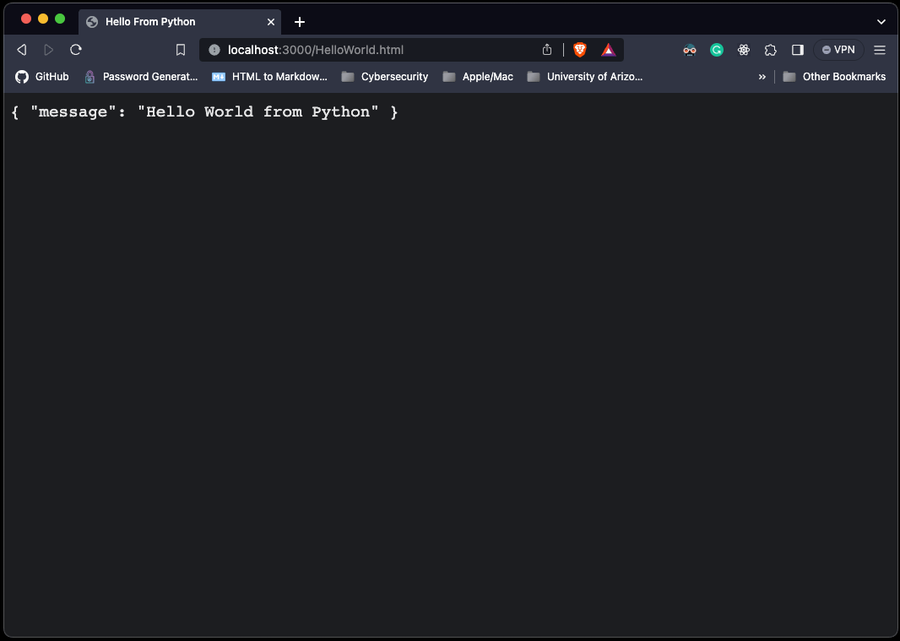

# Web Server

## Lab 1: Basic Web Server

## Description

> In this lab, you will learn the basics of socket programming for TCP connections in Python: how to create
> a socket, bind it to a specific address and port, as well as send and receive a HTTP packet. You will also
> learn some basics of HTTP header format.
>
> You will develop a web server that handles one HTTP request at a time. Your web server should accept
> and parse the HTTP request, get the requested file from the server’s file system, create an HTTP response
> message consisting of the requested file preceded by header lines, and then send the response directly to
> the client. If the requested file is not present in the server, the server should send an HTTP “404 Not
> Found” message back to the client.(Kurose & Ross, 2023)

## Table of Contents

- [Provided Starter Code](#provided-starter-code)
- [Proposed Solution](#proposed-solution)
- [Proposed Solution Usage](#proposed-solution-usage)
- [Optional Exercises](#optional-exercises)
- [Implemented Optional Exercises](#optional-exercise-solutions)

## Provided Starter Code

> Below you will find the skeleton code for the Web server. You are to complete the skeleton code. The
> places where you need to fill in code are marked with #Fill in start and #Fill in end. Each place
> may require one or more lines of code.
>
> ```py
> #import socket module
> from socket import *
> import sys # In order to terminate the program
>
> serverSocket = socket(AF_INET, SOCK_STREAM)
> #Prepare a sever socket
> #Fill in start
> #Fill in end
>
> while True:
> #Establish the connection
>   print('Ready to serve...')
>   connectionSocket, addr = #Fill in start #Fill in end
>
>   try:
>       message = #Fill in start #Fill in end
>       filename = message.split()[1]
>       f = open(filename[1:])
>       outputdata = #Fill in start #Fill in end
>
>       #Send one HTTP header line into socket
>       #Fill in start
>       #Fill in end
>
>       #Send the content of the requested file to the client
>       for i in range(0, len(outputdata)):
>       connectionSocket.send(outputdata[i].encode())
>       connectionSocket.send("\r\n".encode())
>
>       connectionSocket.close()
>
>   except IOError:
>       #Send response message for file not found
>       #Fill in start
>       #Fill in end
>       #Close client socket
>       #Fill in start
>       #Fill in end
>
> serverSocket.close()
> sys.exit()#Terminate the program after sending the corresponding data
>
> ```
>
> (Kurose & Ross, 2023)

### Running the Server

> Put an HTML file (e.g., HelloWorld.html) in the same directory that the server is in. Run the server
> program. Determine the IP address of the host that is running the server (e.g., 128.238.251.26). From
> another host, open a browser and provide the corresponding URL. For example:
>
> [http://128.238.251.26:6789/HelloWorld.html](http://128.238.251.26:6789/HelloWorld.html)
>
> ‘HelloWorld.html’ is the name of the file you placed in the server directory. Note also the use of the port
> number after the colon. You need to replace this port number with whatever port you have used in the
> server code. In the above example, we have used the port number 6789. The browser should then display
> the contents of HelloWorld.html. If you omit ":6789", the browser will assume port 80 and you will get
> the web page from the server only if your server is listening at port 80.
>
> Then try to get a file that is not present at the server. You should get a “404 Not Found” message.
> (Kurose & Ross, 2023)

## Proposed Solution

```py
from socket import socket, AF_INET, SOCK_STREAM
import sys

serverSocket = socket(AF_INET, SOCK_STREAM)

#Prepare a sever socket
serverPort = 3000
serverSocket.bind(('localhost', serverPort))
serverSocket.listen(1)


#Establish the connection
print('Ready to serve...')
while True:
    connectionSocket, addr = serverSocket.accept()

    try:
        message = connectionSocket.recv(1024).decode()
        filename = message.split()[1]
        f = open(filename[1:])
        outPutData = f.read()

        #Send one HTTP header line into socket
        connectionSocket.send('HTTP/1.1 200 OK\r\n\r\n'.encode())
        #Send the HTTP file
        connectionSocket.send(outPutData.encode())
        connectionSocket.send('\r\n'.encode())
        #Close client socket
        connectionSocket.close()

    except IOError:
        #Send response message for file not found
        connectionSocket.send('HTTP/1.1 404 Not Found\r\n\r\n'.encode())
        connectionSocket.send('<html><head></head><body><h1>\
                404 Not Found</h1></body></html>\r\n'.encode())

        connectionSocket.close()


    print('\nServer shutting down...')
    serverSocket.close()
    sys.exit()

```

## Proposed Solution Usage

The code can be run locally from the root of the `1-WebServerLab` folder.

```bash
python server.py

# expected
Ready to serve...
```

Navigate to [http://localhost:3000/HelloWorld.html](http://localhost:3000/HelloWorld.html) using your browser or the embedded link.

If all went well you should see a page like this:



The server should now close and the terminal output should look similar to:

```bash
python server.py

# expected
Ready to serve...

Server shutting down...
```

## Optional Exercises

> 1.  Currently, the web server handles only one HTTP request at a time. Implement a multithreaded server
>     that is capable of serving multiple requests simultaneously. Using threading, first create a main thread
>     in which your modified server listens for clients at a fixed port. When it receives a TCP connection
>     request from a client, it will set up the TCP connection through another port and services the client
>     request in a separate thread. There will be a separate TCP connection in a separate thread for each
>     request/response pair.
>
> 2.  Instead of using a browser, write your own HTTP client to test your server. Your client will connect
>     to the server using a TCP connection, send an HTTP request to the server, and display the server
>     response as an output. You can assume that the HTTP request sent is a GET method.
>     The client should take command line arguments specifying the server IP address or host name, the
>     port at which the server is listening, and the path at which the requested object is stored at the server.
>     The following is an input command format to run the client.
>
> client.py server_host server_port filename
> (Kurose & Ross, 2023)

## Optional Exercise Solutions

### 1. Handle multiple requests concurrently via threading.

The first example is not very useful, after a response is sent to the client the program exits. This example, while still very simple, will not close unless it told to do so via a keyboard interrupt. This can be invoked in the terminal via `ctrl + c`

```py
from socket import socket, AF_INET, SOCK_STREAM
import threading
import sys

# Function to handle client requests
def handle_client(connectionSocket):
    try:
        message = connectionSocket.recv(1024).decode()
        filename = message.split()[1]
        with open(filename[1:], 'rb') as f:
            outPutData = f.read()

        # Send HTTP headers
        connectionSocket.send('HTTP/1.1 200 OK\r\n\r\n'.encode())

        # Send the content of the requested file to the client
        connectionSocket.sendall(outPutData)
        connectionSocket.close()
    except IOError:
        # Send '404 Not Found' response
        not_found_response = 'HTTP/1.1 404 Not Found\r\n\r\n<html><head>\
            </head><body><h1>404 Not Found</h1></body></html>\r\n'
        connectionSocket.send(not_found_response.encode())
        connectionSocket.close()


try:
    # Create a server socket
    serverSocket = socket(AF_INET, SOCK_STREAM)

    # Prepare a server socket
    serverPort = 3000
    serverSocket.bind(('localhost', serverPort))
    # Listen for incoming connections
    # This sets the maximum number of clients that can be waiting to connect to 5,
    # after which point the OS will stop queuing up new connections.
    serverSocket.listen(5)

    print('Server is ready to receive requests...')
    while True:
        # Establish the connection
        connectionSocket, addr = serverSocket.accept()
        print(f'Connection from {addr[0]}:{addr[1]}')

        # Create a thread to handle the client request
        client_thread = threading.Thread(target=handle_client, args=(
            connectionSocket,))
        client_thread.start()

except KeyboardInterrupt:
    print('\nServer shutting down...')
    serverSocket.close()
    sys.exit()

except OSError:
    if serverSocket:
        serverSocket.close()

    print('Socket already in use. Or the server is already running. Try again later.')
    sys.exit()

except Exception as e:
    print(e)
    sys.exit()

```

#### Usage instructions

The usage will be very similar to before, but we need to access a different file.

```bash
python server-opt1.py

# expected
Server is ready to receive requests...
```

Your server should be running. We need to request the same HTML file as before:

Navigate to [http://localhost:3000/HelloWorld.html](http://localhost:3000/HelloWorld.html) using your browser or the embedded link.

You should see a web page like before:


The terminal output should now look something like this, note that the port numbers are selected at random and may be different from the numbers shown below.

```bash
python server-opt1.py

# expected
Server is ready to receive requests...
Connection from 127.0.0.1:50429
```

### 2. HTTP Client

This option had basic requirements and I went with a no frills approach here.

```py
from socket import socket, AF_INET, SOCK_STREAM
import sys

if len(sys.argv) != 4:
    print("Required arguments: server_host server_port filename")
    sys.exit(1)

try:
    server_host = sys.argv[1]
    server_port = int(sys.argv[2])
    filename = sys.argv[3]

    #  create TCP socket for server
    client_socket = socket(AF_INET, SOCK_STREAM)

    # connect to server
    client_socket.connect((server_host, server_port))

    #  send HTTP request to server
    request = "GET /" + filename + " HTTP/1.1\r\n\r\n"

    client_socket.send(request.encode())

    #  receive HTTP response from server and display
    response = client_socket.recv(1024)

    print(response.decode())

    #  close connection
    client_socket.close()

except IOError:
    print("Error: file not found")
    sys.exit(1)

except Exception as e:
    print(e)
    sys.exit(1)

# exit the program
sys.exit(0)
```

#### Usage Instructions

```bash
python server-opt1.py
```

From the same location, open a new terminal, and run

```bash
python client.py localhost 3000 HelloWorld.html
```

Expected response:

```bash
python client.py localhost 3000 HelloWorld.html
HTTP/1.1 200 OK

<!DOCTYPE html>
<html lang="en">

<head>
    <meta charset="UTF-8">
    <meta name="viewport" content="width=device-width, initial-scale=1.0">
    <title>Hello From Python</title>
    <style>
        html {
            font-family: Arial, Helvetica, sans-serif;
            font-size: 1.2rem;
            line-height: 1.5;
            color: #e5e5e5;
            background-color: rgb(28, 29, 31);
        }
    </style>
</head>

<body>
    <code>
            {
                "message": "Hello World from Python"
            }
        </code>

    <script text="text/javascript">
        console.log('Hello World from Python');
    </script>
</body>

</html>
```

The client closes after a successful response, as it should since we invoke the arguments when the file. We could improve this to take input from the user and run on a loop so we can make multiple requests.

## References

Kurose, J., & Ross, K. (2023). Programming Assignments. Computer Network Research Group - UMass Amherst.
Retrieved September 8, 2023, from [https://gaia.cs.umass.edu/kurose_ross/programming.php](https://gaia.cs.umass.edu/kurose_ross/programming.php)

## LICENSE

This project is Licensed by the [MIT LICENSE](../LICENSE).

## Back to Main

[Click here to go back](../README.md)
